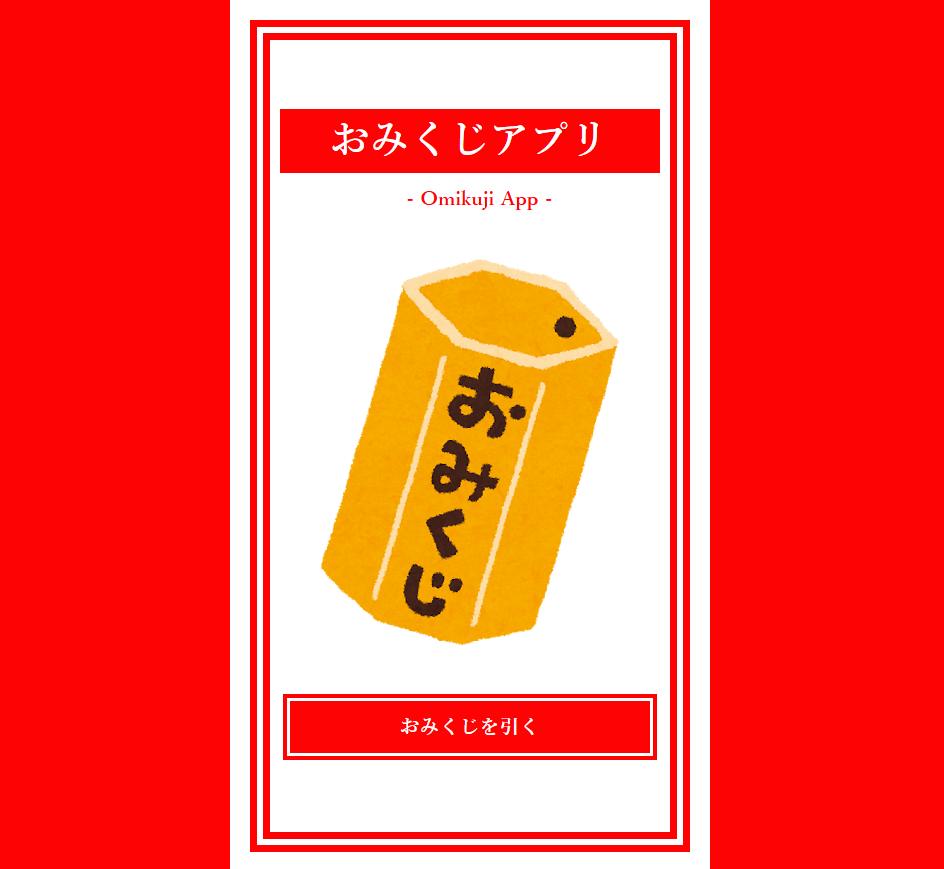
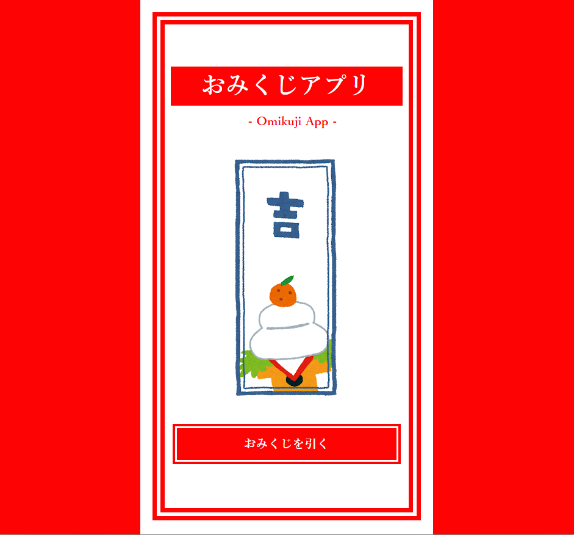

# おみくじアプリ

JavaScriptで作成したシンプルなおみくじアプリです。

ボタンを押すと、おみくじがシャッフルされ、ランダムに結果が表示されます。
JavaScriptによるDOM操作やイベント処理、タイマー処理を学ぶことを目的として制作しました。

---

## デモ画面

初期画面


おみくじ実行後


---

## 使用技術

* HTML5
* CSS3
* JavaScript（ES6）

---

## 主な機能

* ランダムでおみくじ画像を表示
* ボタン連打防止
* おみくじを振るアニメーション
* レスポンシブ対応

---

## ディレクトリ構成

```text
omikuji-app/
├── images/
├── index.html
├── style.css
├── script.js
└── README.md
```

---

## 工夫した点

* HTML・CSS・JavaScriptを役割ごとに分割し、保守しやすい構成にしました。
* JavaScriptで画像をランダムに切り替え、おみくじの結果が毎回変わるようにしました。
* ボタンを連続でクリックできないようにし、アニメーション中の誤操作を防止しました。
* CSSアニメーションを使用し、おみくじを振っているような演出を実装しました。
* スマートフォンでも表示が崩れないよう、レスポンシブ対応を行いました。

---

## 学んだこと

このアプリの制作を通して、以下の内容を学びました。

* DOM操作
* イベント処理
* `setInterval()` と `setTimeout()` の使い方
* ランダム処理
* CSSアニメーション
* Flexboxを利用したレイアウト
* レスポンシブデザイン

---

## 今後の改善点

* おみくじの結果（大吉・中吉・小吉など）をテキストでも表示する
* 効果音を追加する
* フェードイン・フェードアウトなどの演出を追加する
* おみくじの履歴を表示する機能を実装する

---

## ライセンス

このプロジェクトは学習目的で作成したものです。
